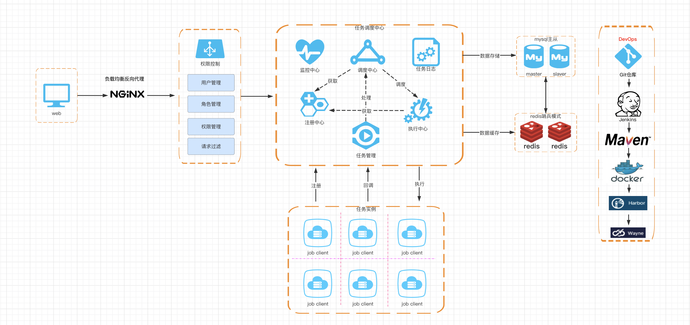
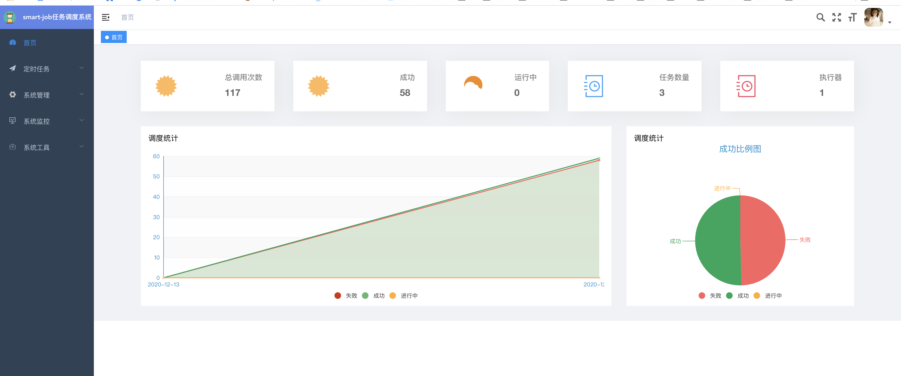
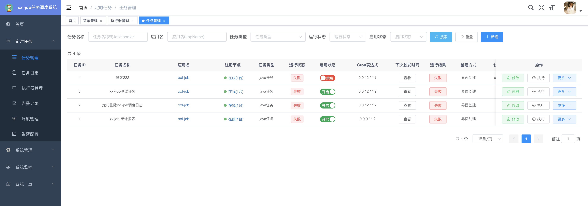
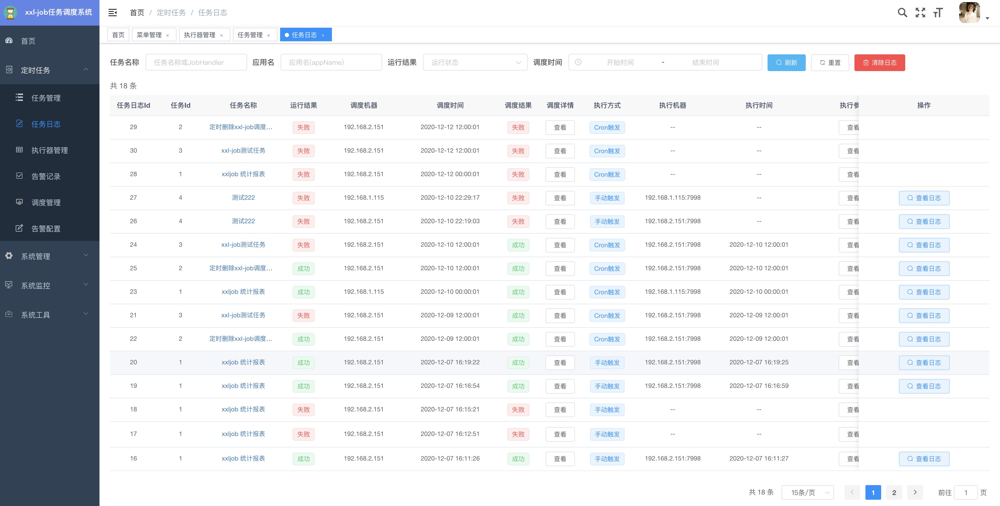
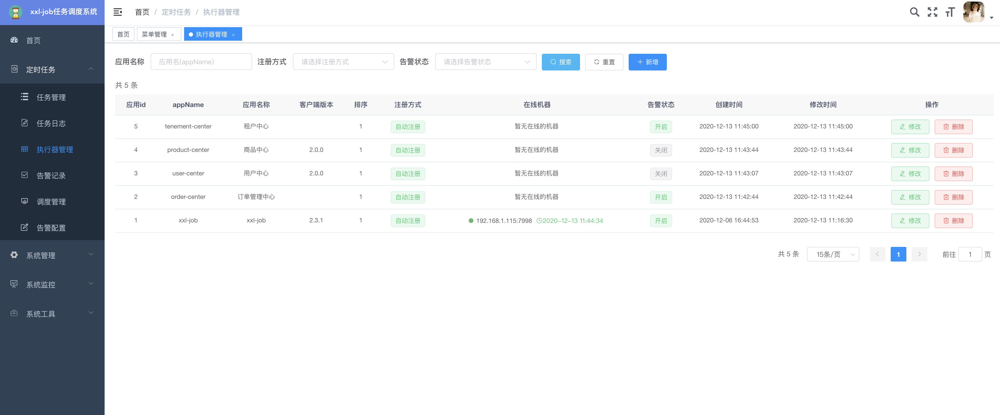
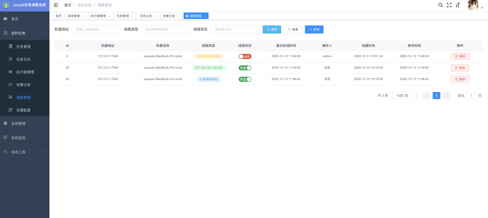
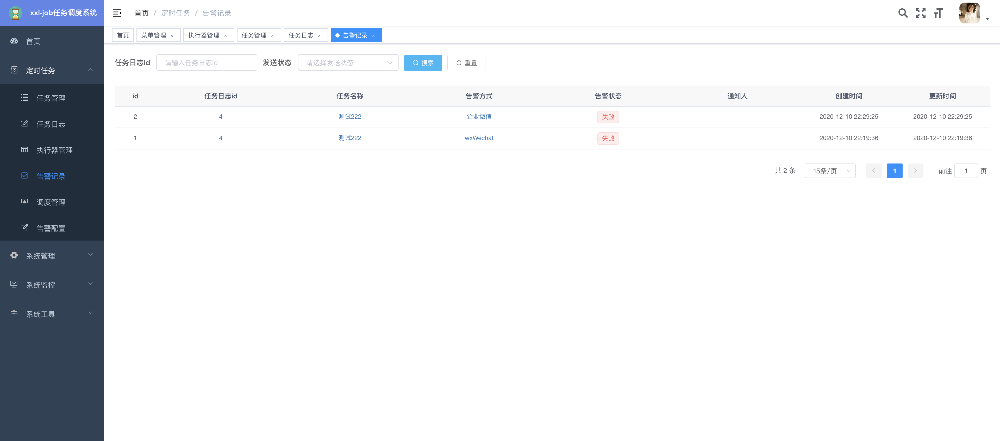
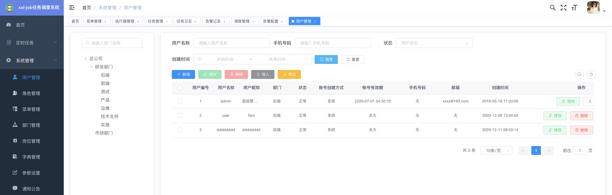
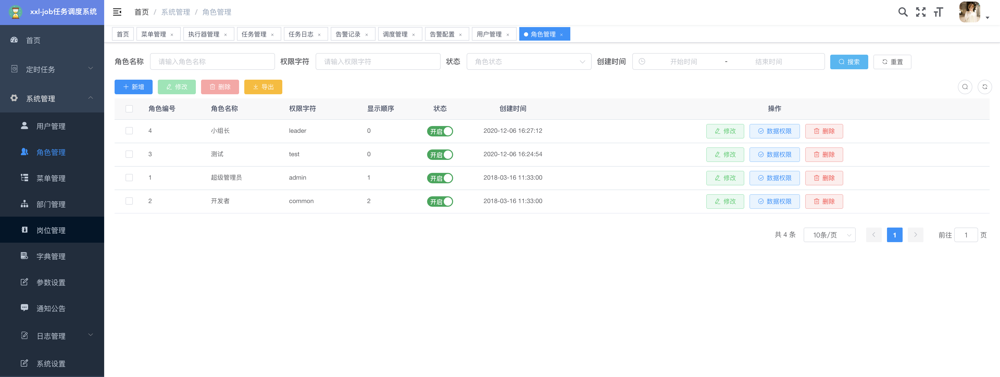

<p align="center" >
    
    <h3 align="center">Smart-Job</h3>
    <p align="center">
        Smart-Job, a distributed task scheduling framework.
        <br>
        <br>
        <a href="https://maven-badges.herokuapp.com/maven-central/cn.smartcoding/smart-job-core/">
            
        </a>
        <a href="https://github.com/smart-coding-team/smart-job/releases">
         
        </a>
        <a href="https://github.com/smart-coding-team/smart-job/">
            
        </a>
        <a href="https://hub.docker.com/repository/docker/wuque1024/smart-job/">
            
        </a>
        <a href="https://en.wikipedia.org/wiki/MIT_License">
         
        </a>
    </p>
</p>

## 项目简介

smart-job是一个分布式任务调度平台,学习简单，轻量级，易扩展，开箱即用,提供用户体验极佳的页面管理。

## 架构图



## 在线体验

演示地址：http://demo.smartcoding.cn:1024/

- demo/demo123 
- 如果喜欢😍，麻烦点个star


## 特点

1、容器化：提供docker镜像，提供docker镜像编排docker-compose.yml，实现开箱即用，一键部署。

2、简单：支持通过Web页面和API接口两种方式创建任务，web界面提供任务的CRUD操作，同时也支持预测任务下次触发的时间。

3、动态：支持动态修改任务状态、启动/停止任务，以及终止运行中任务，即时生效,注册节点定期主动上报到调度中心状态。

4、调度中心HA（中心式）：调度采用中心式设计，“调度中心”自研调度组件并支持集群部署，可保证调度中心HA；

5、执行器HA（分布式）：任务分布式执行，任务”执行器”支持集群部署，可保证任务执行HA；

6、注册中心: 执行器会周期性自动注册任务, 调度中心将会自动发现注册的任务并触发执行。同时，也支持手动录入执行器地址；

7、弹性扩容缩容：一旦有新执行器机器上线或者下线，下次调度时将会重新分配任务；

8、触发策略：提供丰富的任务触发策略，包括：Cron触发、固定间隔触发、固定延时触发、API（事件）触发、人工触发、父子任务触发；

9、调度过期策略：调度中心错过调度时间的补偿处理策略，包括：忽略、立即补偿触发一次等；

10、阻塞处理策略：调度过于密集执行器来不及处理时的处理策略，策略包括：单机串行（默认）、丢弃后续调度、覆盖之前调度；

11、任务超时控制：支持自定义任务超时时间，任务运行超时将会主动中断任务；

12、任务失败重试：支持自定义任务失败重试次数，当任务失败时将会按照预设的失败重试次数主动进行重试；其中分片任务支持分片粒度的失败重试；

13、任务失败告警；完善的告警体系，支持告警内容自定义，支持告警记录发送查看，默认支持钉钉，企业微信告警，同时预留扩展接口，可方便的扩展短信、电话等告警方式；

14、任务日志管理: 详情的任务调度,执行全过程日志，实时监控任务在各个阶段下运行的状态

15、路由策略：执行器集群部署时提供丰富的路由策略，包括：第一个、最后一个、轮询、随机、一致性HASH、最不经常使用、最近最久未使用、故障转移、忙碌转移等；

16、分片广播任务：执行器集群部署时，任务路由策略选择”分片广播”情况下，一次任务调度将会广播触发集群中所有执行器执行一次任务，可根据分片参数开发分片任务；

17、动态分片：分片广播任务以执行器为维度进行分片，支持动态扩容执行器集群从而动态增加分片数量，协同进行业务处理；在进行大数据量业务操作时可显著提升任务处理能力和速度。

18、故障转移：任务路由策略选择”故障转移”情况下，如果执行器集群中某一台机器故障，将会自动Failover切换到一台正常的执行器发送调度请求。

19、任务进度监控：支持实时监控任务进度，任务当前执行状态，任务调度状态，任务触发状态的查看。

20、Rolling实时日志：支持在线查看调度结果，并且支持以Rolling方式实时查看执行器输出的完整的执行日志。

21、GLUE：提供Web IDE，支持在线开发任务逻辑代码，动态发布，实时编译生效，省略部署上线的过程。支持30个版本的历史版本回溯。

22、脚本任务：支持以GLUE模式开发和运行脚本任务，包括Shell、Python、NodeJS、PHP、PowerShell等类型脚本;

23、命令行任务：原生提供通用命令行任务Handler（Bean任务，”CommandJobHandler”）；业务方只需要提供命令行即可；

24、任务依赖：支持配置子任务依赖，当父任务执行结束且执行成功后将会主动触发一次子任务的执行, 多个子任务用逗号分隔；

25、一致性：“调度中心”通过DB锁保证集群分布式调度的一致性, 一次任务调度只会触发一次执行；

26、自定义任务参数：支持在线配置调度任务入参，即时生效；

27、调度线程池：调度系统多线程触发调度运行，确保调度精确执行，不被堵塞；

28、数据加密：调度中心和执行器之间的通讯进行数据加密，提升调度信息安全性；

29、推送maven中央仓库: 将会把最新稳定版推送到maven中央仓库, 方便用户接入和使用;

30、运行报表：支持实时查看运行数据，如任务数量、调度次数、执行器数量等；以及调度报表，如调度日期分布图，调度成功分布图等；

31、全异步：任务调度流程全异步化设计实现，如异步调度、异步运行、异步回调等，有效对密集调度进行流量削峰，理论上支持任意时长任务的运行；

32、线程池隔离：调度线程池进行隔离拆分，慢任务自动降级进入”Slow”线程池，避免耗尽调度线程，提高系统稳定性；

33、账号管理：支持在线管理系统用户,分配角色，账号的启停操作，有效期等操作

34、身份认证：资源统一登录与认证，目前支持普通登录，LDAP认证，接入企业内部的账号系统更加方便

35、 权限控制：采用RBAC模型的权限管理系统，权限检验支持前后端双重校验，更加安全可靠。

36、角色管理：角色菜单权限分配、设置角色按机构进行数据范围权限划分

37、参数管理：对系统动态配置常用参数。

38、安全审计：支持在线会话内容审计，支持用户操作行为审计。

39、服务监控：监视当前系统CPU、内存、磁盘、堆栈等相关信息。

40、连接池监视：监视当前系统数据库连接池状态，可进行分析SQL找出系统性能瓶颈。

## 代码仓库

| 项目名称             | Github                                         | Gitee |
| -------------------- | ---------------------------------------------- | ----- |
| Smart-job(后端)    | [Github](https://github.com/smart-coding-team/smart-job) | [gitee](https://gitee.com/smart-coding-team/smart-job)      |
| Smart-job-ui(前端) |[Github](https://github.com/smart-coding-team/smart-job-ui)| [gitee](https://gitee.com/smart-coding-team/smart-job-ui)        |


## 项目结构
```
├── smart-job-common     ## 公共的组件
├── smart-job-core       ## 定时任务模块
├── smart-job-framework  ## 外部依赖模块
├── smart-job-generator  ## 代码生成器模块
├── smart-job-schedule   ## 任务调度模块
├── smart-job-starter    ## 任务stater模块
├── smart-job-system     ## 用户权限模块
└── smart-job-web        ## API接口模块
├── Dockerfile  
├── LICENSE
├── README.md
├── doc
├── docker-entrypoint.sh
├── pom.xml
```


## 快速部署

1、[一键部署](doc/data/READEM.md)

## 快速入门


1、方式一（原生接入）

引入maven
```
<dependency>
    <groupId>cn.smartcoding</groupId>
    <artifactId>smart-job-core</artifactId>
    <version>1.0.0</version>
</dependency>
```

XxlJobConfig 接入类
```java
@Configuration
public class XxlJobConfig {
    private Logger logger = LoggerFactory.getLogger(XxlJobConfig.class);
    @Value("${xxl.job.adminAddresses}")
    private String adminAddresses;

    @Value("${xxl.job.accessToken}")
    private String accessToken;

    @Value("${xxl.job.executor.appName}")
    private String appName;

    @Value("${xxl.job.executor.title}")
    private String title;

    @Value("${xxl.job.executor.autoStartJob:false}")
    private boolean autoStartJob;

    @Value("${xxl.job.executor.autoCreateJob:false}")
    private boolean autoCreateJob;

    @Value("${xxl.job.executor.ip:}")
    private String ip;

    @Value("${xxl.job.executor.port}")
    private int port;

    @Value("${xxl.job.executor.logpath}")
    private String logPath;

    @Value("${xxl.job.executor.logretentiondays}")
    private int logRetentionDays;

    @Bean(initMethod = "start", destroyMethod = "destroy")
    public XxlJobSpringExecutor xxlJobExecutor() {
        logger.info(">>>>>>>>>>> xxl-job config init.");
        XxlJobSpringExecutor xxlJobSpringExecutor = new XxlJobSpringExecutor();
        xxlJobSpringExecutor.setAdminAddresses(adminAddresses);
        xxlJobSpringExecutor.setAppName(appName);
        if (title == null) {
            xxlJobSpringExecutor.setTitle(appName);
        } else {
            xxlJobSpringExecutor.setTitle(title);
        }
        xxlJobSpringExecutor.setIp(ip);
        xxlJobSpringExecutor.setPort(port);
        xxlJobSpringExecutor.setAccessToken(accessToken);
        xxlJobSpringExecutor.setLogPath(logPath);
        xxlJobSpringExecutor.setLogRetentionDays(logRetentionDays);
        xxlJobSpringExecutor.setAutoStartJob(autoStartJob);
        xxlJobSpringExecutor.setAutoCreateJob(autoCreateJob);
        return xxlJobSpringExecutor;
    }
}
```
application.yml 配置文件
```yaml
xxl:
  job:
    accessToken: 0e8701d4307a445c90b4e70565893a95
    adminAddresses: http://127.0.0.1:7040
    applicationName: 调度平台-开发环境
    executor:
      appName: xxl-job
      title: xxl-job
      autoCreateJob: true
      autoStartJob: true
      ip: ''
      logpath: /data/logs/xxl-job/jobhandler
      logretentiondays: 3
      port: 7998
```

2. 方式二（starter）
引入maven

```
<dependency>
    <groupId>cn.smartcoding</groupId>
    <artifactId>smart-job-starter</artifactId>
    <version>1.0.0</version>
</dependency>
```
application.yml 配置文件
```yaml
xxl:
  job:
    accessToken: 0e8701d4307a445c90b4e70565893a95
    adminAddresses: http://127.0.0.1:7040
    applicationName: 调度平台-开发环境
    executor:
      appName: xxl-job
      title: xxl-job
      autoCreateJob: true
      autoStartJob: true
      ip: ''
      logpath: /data/logs/xxl-job/jobhandler
      logretentiondays: 3
      port: 7998
```


## 演示图

1、登录界面


2、首页


3、任务管理


4、任务日志


5、任务执行器


6、任务调度管理


7、任务告警


8、任务告警配置







